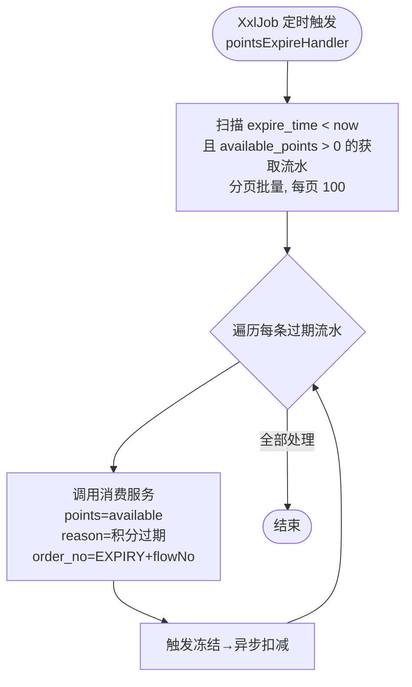
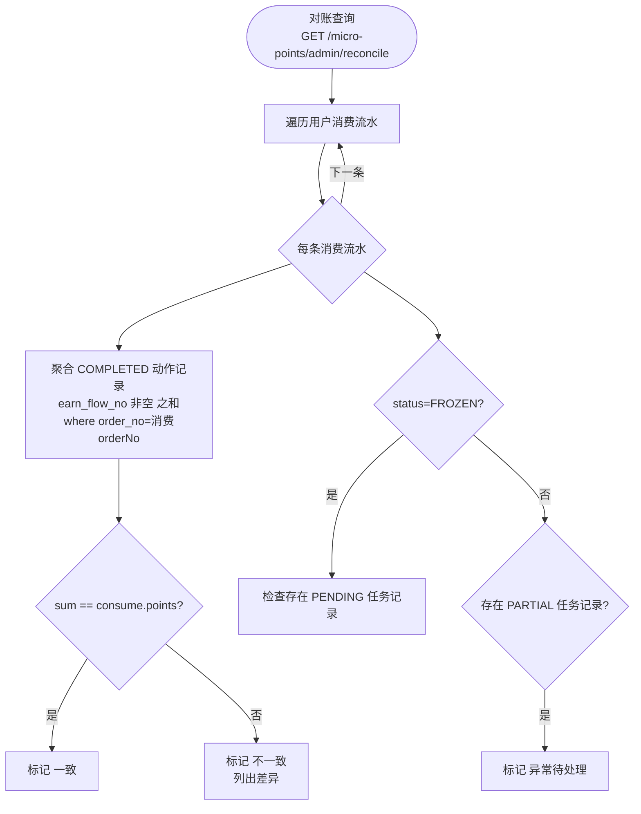

# Story: 积分过期与对账

## 描述

作为系统，通过 XxlJob 定时任务扫描过期获取流水并模拟消费流程回收积分（保证与正常消费数据一致），通过 PointsReconcileService 核对消费流水与扣减记录一致性，发现数据不一致（PARTIAL 任务记录 / 扣减金额不匹配 / FROZEN 消费无 PENDING 任务记录等异常情况）。

## 参与者

| 角色 | 说明 |
|------|------|
| 系统 | micro-points 后台任务（XxlJob 定时扫描 + 对账服务） |
| 管理员 | 通过运营端 REST 调用对账查询，核对一致性 |
| 用户 | 钱包所有者，过期积分的归属人 |

## 流程图

### 积分过期定时处理

过期**模拟消费流程**：创建消费流水（reason=积分过期）→ 冻结 → PENDING → 异步扣减，保证数据一致。

**过期与消费冻结的竞态处理**：若过期的积分已被其他消费冻结（钱包可用=0 但获取流水仍有 available），过期消费会因钱包余额校验失败跳过该流水，不报错。这是正确行为——这些积分已被分配，等异步扣减后该获取流水 available=0，过期不再处理。

### 对账查询流程

对账核对 `points_consume_record`（消费流水）与 `points_deduction_record`（扣减记录）一致性：
- `PARTIAL` 任务记录：标记"异常待处理"（优先级最高，无论消费状态）
- `DEDUCTED` 消费：COMPLETED 动作记录之和 == 消费 points 则"一致"，否则"不一致"
- `FROZEN` 消费：存在对应 `PENDING` 任务记录则"冻结中"，否则"异常"

对账时**仅统计 COMPLETED 动作记录**（`earn_flow_no` 非空），不统计任务记录。

## 验收标准

### 积分过期定时任务
- [ ] 过期扫描：Given 获取流水 expire_time < now 且 available_points > 0, When XxlJob `pointsExpireHandler` 触发, Then 分页扫描（每页 100），对每条调用 PointsConsumeService.consume（points=available, reason=积分过期, order_no=EXPIRY+flowNo），触发冻结→异步扣减链路
- [ ] 过期模拟消费：过期积分通过消费流程回收，与正常消费数据一致（创建消费流水 FROZEN → PENDING 任务记录 → 异步扣减 PROCESSED → 消费流水 DEDUCTED）
- [ ] 过期与消费冻结竞态：Given 过期积分已被其他消费冻结（钱包可用=0 但获取流水仍有 available）, When 过期处理, Then 消费余额校验失败跳过该流水，不报错；等异步扣减后 available=0，过期不再处理
- [ ] 关键位置加 log：扫描数量、处理结果、跳过原因均有日志

### 对账查询
- [ ] 对账一致性（DEDUCTED）：Given 消费流水 status=DEDUCTED, When 调用 PointsReconcileService.reconcile, Then 聚合 COMPLETED 动作记录（earn_flow_no 非空）deduction_points 之和，sum == consume.points 则"一致"，否则"不一致"列差异
- [ ] 对账冻结中（FROZEN）：Given 消费流水 status=FROZEN, When 对账, Then 检查存在 PENDING 任务记录则"冻结中"，否则"异常"
- [ ] 对账异常待处理（PARTIAL）：Given 存在 PARTIAL 任务记录, When 对账, Then 标记"异常待处理"（优先级最高，无论消费状态）
- [ ] 仅统计动作记录：对账仅统计 COMPLETED 动作记录（earn_flow_no 非空），不统计任务记录（earn_flow_no=NULL）
- [ ] 对账返回字段：返回 consumeFlowNo/points/deductedSum/diff/status，供前端展示差异
- [ ] 对账异常告警：状态为"不一致"/"异常"/"异常待处理"时输出告警日志

## 关联模块
- micro-points

## 关联 API / 服务接口
- `PointsExpireJob.execute()` — @XxlJob "pointsExpireHandler" 过期定时任务
- `PointsConsumeService.consume(PointsConsumeReq)` — 过期模拟消费（被 Job 调用）
- `PointsAsyncDeductService.processAllPending()` — PENDING 兜底重试（过期触发的异步扣减失败时重试）
- `GET /micro-points/admin/reconcile` — 对账查询（运营端）
- `GET /micro-points/admin/consume/deduction/page` — 消费扣减明细（人工对账）
- `PointsReconcileService.reconcile(PointsReconcileReq)` — 对账服务

## 优先级
P0

## 状态
已开发

## 关联 PRD 章节
- spec.md §5.6 积分过期（定时任务）
- spec.md §5.7 对账
- spec.md §13.7 EP6 积分过期
- spec.md §13.8 EP7 对账
