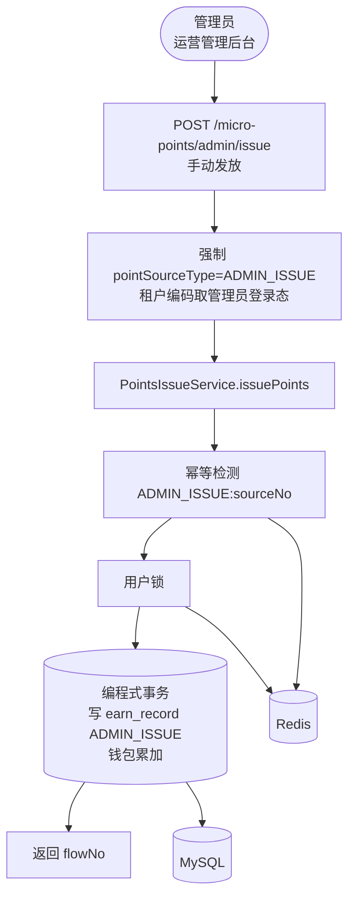
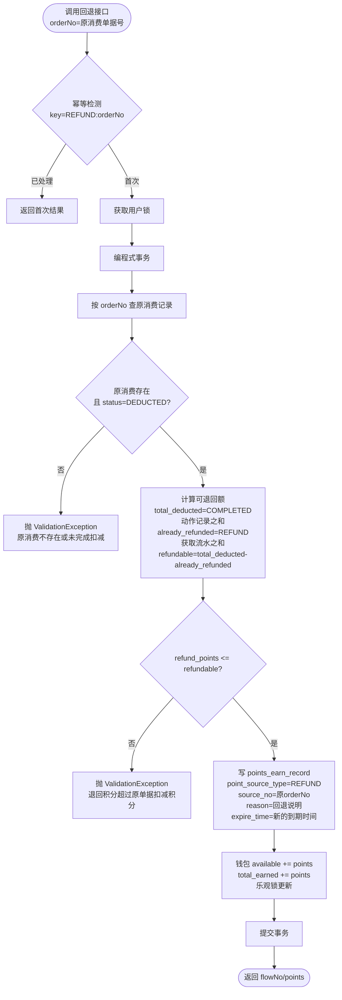

# Story: 管理员手动发放与回退

## 描述

作为管理员，通过运营端 REST 手动给用户发放积分（客服补偿等场景，pointSourceType=ADMIN_ISSUE）。作为业务方，通过 PointsRefundService 以发放方式回退积分（订单退款时同步退回积分，pointSourceType=REFUND），含原单据校验（原消费必须存在且 status=DEDUCTED）与超额防护（refund_points ≤ total_deducted - already_refunded）。

## 参与者

| 角色 | 说明 |
|------|------|
| 管理员 | 运营管理后台操作人员，通过运营端 REST 手动发放 |
| 业务方 | 主应用业务系统，调用 PointsRefundService 回退积分 |
| 用户 | 钱包所有者，积分发放/回退的对象 |

## 流程图

### 管理员手动发放

管理员手动发放复用 `PointsIssueService`，仅 `pointSourceType=ADMIN_ISSUE`、入口为运营端 REST，幂等键 bizType = ADMIN_ISSUE（与 ISSUANCE 区分）。

### 积分回退（含原单据校验）

回退**复用发放逻辑**（写获取流水 + 钱包累加），但额外增加原单据校验：
1. 按 `orderNo` 查原消费记录，必须存在且 `status=DEDUCTED`（未完成扣减的消费不可回退）
2. `total_deducted` = 该 orderNo 的 COMPLETED 动作记录（earn_flow_no 非空）deduction_points 之和
3. `already_refunded` = 该 orderNo 对应的 REFUND 获取流水（source_no=orderNo）points 之和
4. `refundable` = total_deducted - already_refunded
5. 校验 `refund_points <= refundable`，否则抛异常

**不更新原消费记录状态**（保持 DEDUCTED），回退关系仅通过获取流水的 `source_no` 关联。

**注意**：回退**不调用 `PointsIssueService.issuePoints`** 的幂等/锁（外层已做，否则会导致同一用户锁重复获取死锁）。

## 验收标准

### 管理员手动发放
- [ ] 管理员手动发放：Given PointsIssueReq(userCode/points/reason/sourceNo), When 调用 POST /micro-points/admin/issue, Then REST 层强制 pointSourceType=ADMIN_ISSUE，复用 PointsIssueService，写 points_earn_record 的 point_source_type = ADMIN_ISSUE，钱包累加 available + total_earned，返回 flowNo/points/availablePoints/totalEarnedPoints
- [ ] 管理员发放幂等：Given 同一 sourceNo, When 重复调用管理员发放, Then 仅生效一次（幂等键 `ADMIN_ISSUE:sourceNo`，与 `ISSUANCE:sourceNo` 区分）
- [ ] 运营端操作记录管理员：租户编码取管理员登录态，createBy 由框架自动填充管理员账号

### 积分回退
- [ ] 业务方回退：Given PointsRefundReq(userCode/points/reason/orderNo/expireTime), When 调用 PointsRefundService.refund, Then 复用发放逻辑（point_source_type=REFUND, source_no=原orderNo），写 points_earn_record（available=points, used=0），钱包累加 available + total_earned，expire_time 取入参或 DB 默认 2099-12-31 23:59:59，不更新原消费记录状态（保持 DEDUCTED），返回 flowNo/points
- [ ] 回退原单据校验：Given orderNo, When 回退, Then 按 orderNo 查原消费记录，必须存在且 status=DEDUCTED；原消费不存在或 status=FROZEN 时抛 ValidationException
- [ ] 回退超额防护：Given refund_points, When 回退, Then 校验 refund_points <= refundable = total_deducted - already_refunded；超额时抛 ValidationException；多次部分回退累计不超过 total_deducted
- [ ] 回退幂等：Given 同一 orderNo, When 重复调用回退, Then 仅生效一次（幂等键 `REFUND:orderNo`），同一 orderNo 仅支持单次完整回退
- [ ] 不调用 PointsIssueService.issuePoints：回退复用发放核心逻辑（doRefund），但不调用 issuePoints 的幂等/锁（外层已做），避免同一用户锁重复获取死锁

## 关联模块
- micro-points

## 关联 API / 服务接口
- `POST /micro-points/admin/issue` — 管理员手动发放（运营端 REST，强制 ADMIN_ISSUE）
- `PointsIssueService.issuePoints(PointsIssueReq)` — 发放服务（业务方与管理员共用）
- `PointsRefundService.refund(PointsRefundReq)` — 积分回退服务

## 优先级
P0

## 状态
已开发

## 关联 PRD 章节
- spec.md §5.1 积分发放（含管理员手动发放）
- spec.md §5.5 积分回退（含原单据校验）
- spec.md §13.3 EP2 积分发放（US-IS-002 管理员手动发放）
- spec.md §13.6 EP5 积分回退
