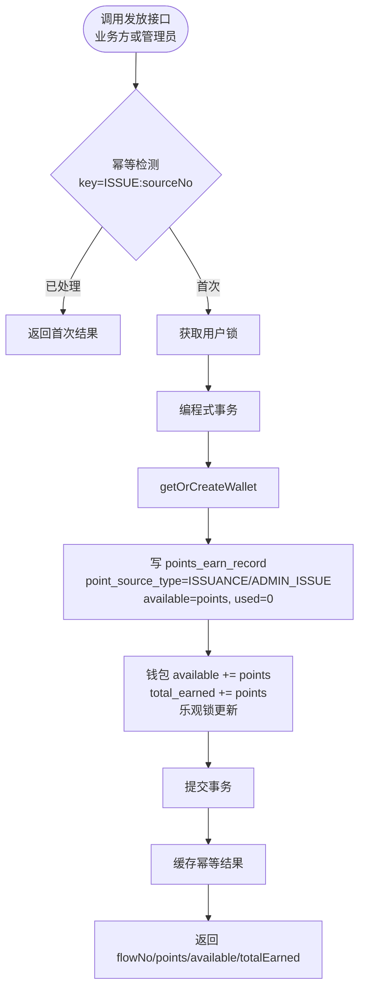
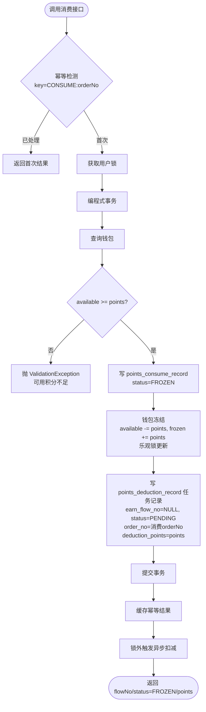
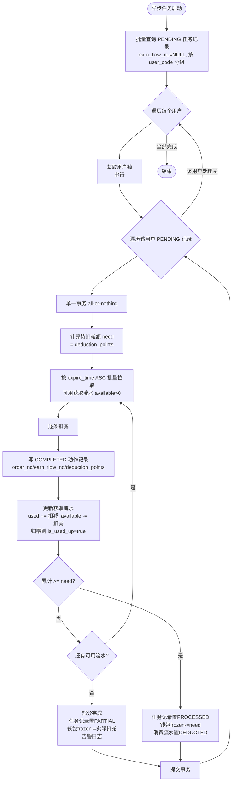
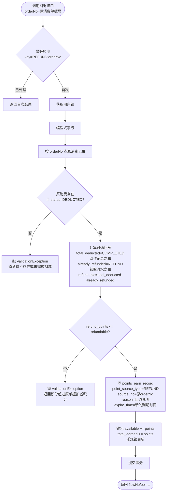
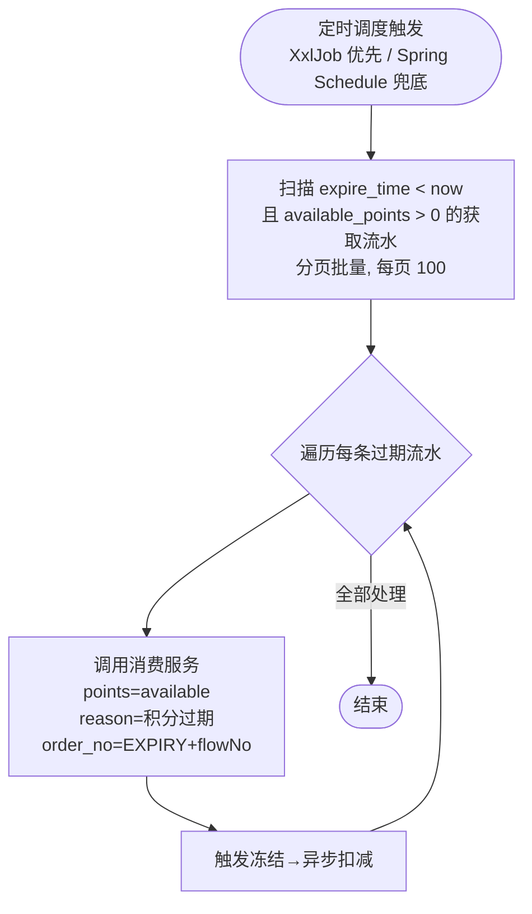
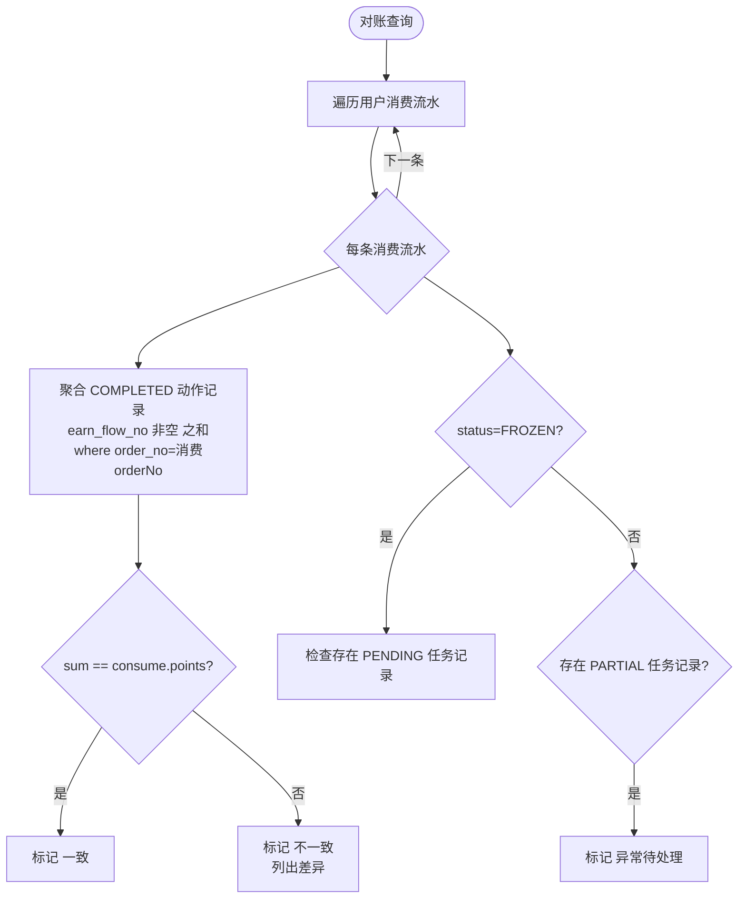
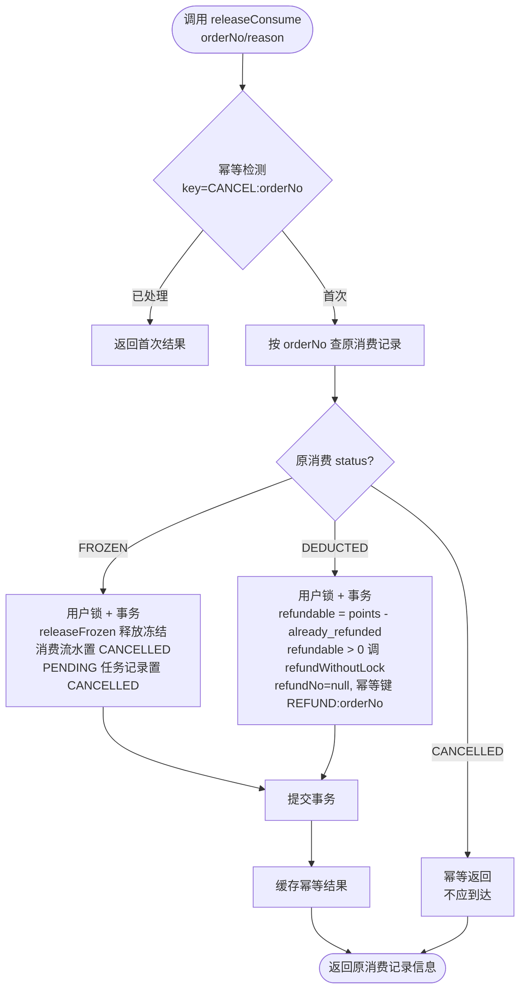
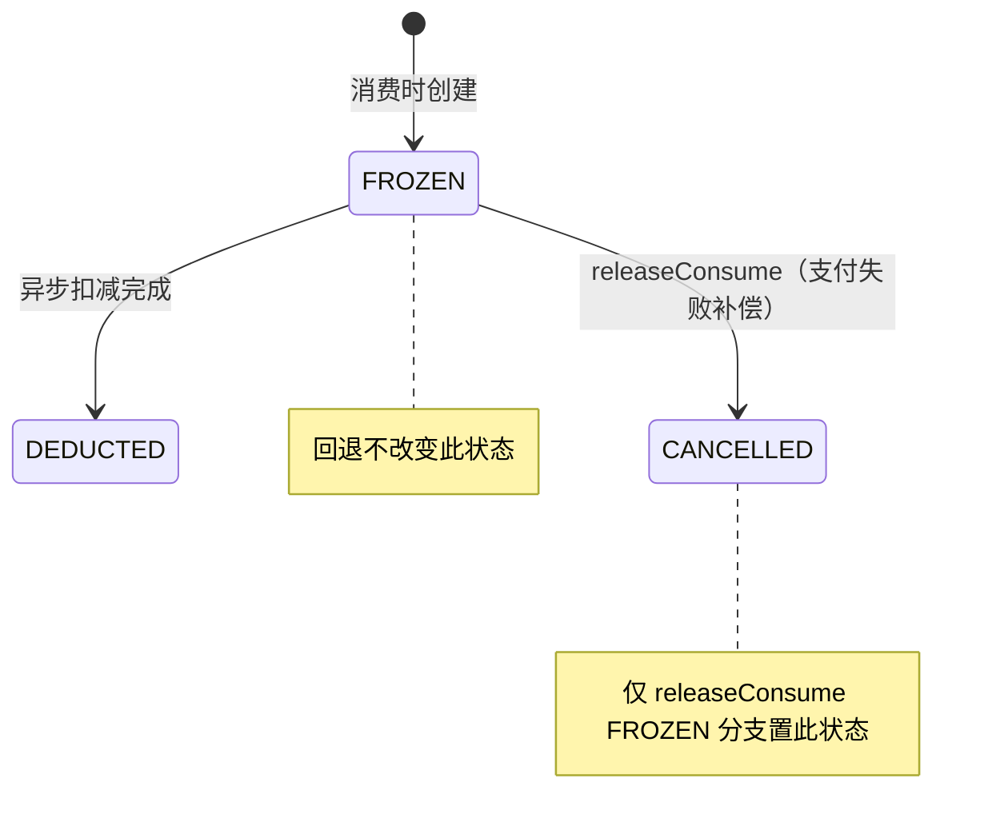
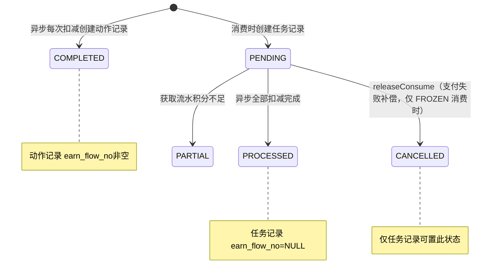
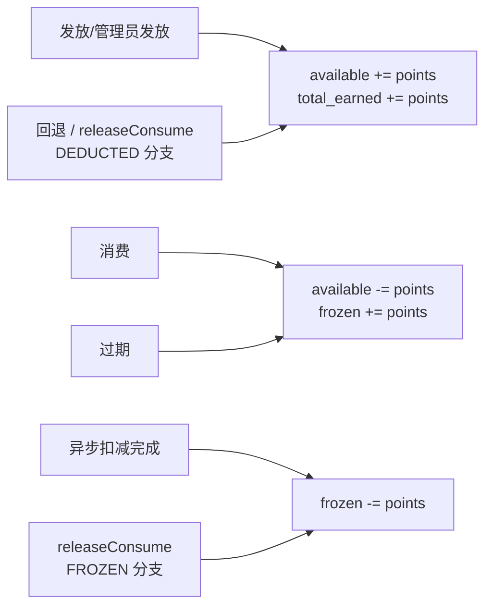

# micro-points 模块开发指南

本文档帮助开发者快速理解 `micro-points` 模块的架构设计、核心功能和开发规范。

## 📦 模块概述

`micro-points` 是积分账户能力模块，API 前缀 `/micro-points`，提供完整的积分账户体系：积分发放、试算、消费（冻结→异步扣减两阶段）、回退、过期、对账。

### 核心特性

- **积分钱包**：按 `(tenant_code, user_code)` 唯一，维护可用 / 冻结 / 历史总额三态，首次发放或查询时按需创建
- **积分发放**：业务方（`ISSUANCE`）与管理员手动发放（`ADMIN_ISSUE`）共用 `PointsIssueService`
- **积分试算**：按 100:1（100 积分 = 1 元）换算可抵扣金额，只读
- **两阶段消费**：同步冻结（`FROZEN`）→ 异步扣减（`@Async`），保证消费接口快速返回
- **积分消费取消（支付失败补偿）**：`releaseConsume(orderNo, reason)` 在支付失败时补偿——FROZEN 释放冻结并置 CANCELLED；DEDUCTED 调 `refundWithoutLock` 退剩余全部积分；幂等键 `CANCEL:orderNo`
- **积分回退**：以发放方式回退（`REFUND`），含原单据校验与超额防护
- **积分过期**：定时扫描（XxlJob 优先 / Spring Schedule 兜底），模拟消费流程触发冻结→异步扣减
- **对账**：核对消费流水与 COMPLETED 动作记录一致性
- **用户级串行**：基于 RedisLock（`points:lock:{userCode}`），同一用户串行，不同用户并行
- **幂等检测**：基于 Redis（`points:idempotent:{bizType}:{bizNo}`），使用业务单据号，与 `flow_no` 解耦

---

## 🏗️ 架构设计

```
┌──────────────────────────────────────────────────────────────┐
│                     REST 层（前缀 /micro-points）              │
│  PointsRest(C端，只读)      PointsAdminRest(运营端，按userCode) │
└──────────────────────────────────────────────────────────────┘
                              ↓
┌──────────────────────────────────────────────────────────────┐
│                  Service 层（对内服务 + 业务服务）              │
│  PointsIssueService    PointsTrialService   PointsConsumeService
│  PointsRefundService   PointsAsyncDeductService(@Async)        │
│  PointsReconcileService PointsWalletService(extends BaseService)│
└──────────────────────────────────────────────────────────────┘
                              ↓
┌──────────────────────────────────────────────────────────────┐
│             Helper 层（幂等 + 用户锁，基于 Redis）              │
│  PointsIdempotentHelper        PointsLockHelper               │
└──────────────────────────────────────────────────────────────┘
                              ↓
┌──────────────────────────────────────────────────────────────┐
│          Mapper 层（MyBatis，4 个 Mapper + XML）               │
│  PointsWalletMapper / PointsEarnRecordMapper                  │
│  PointsConsumeRecordMapper / PointsDeductionRecordMapper      │
└──────────────────────────────────────────────────────────────┘
                              ↓
┌──────────────────────────────────────────────────────────────┐
│          Job 层（XxlJob 定时任务，积分过期回收）                 │
│  PointsExpireJob (XxlJob 优先 / Spring @Scheduled 兜底)         │
└──────────────────────────────────────────────────────────────┘
```

### 关键设计取舍

- **不引入 SPI**：消费 / 回退所需参数由调用方直接传入，不回查业务系统
- **不引入批次号**：扣减溯源仅靠"消费单据号 `order_no` + 获取流水号 `earn_flow_no`"
- **两阶段消费**：同步冻结快速返回，真实扣减异步完成，事务粒度为单条 PENDING 记录
- **`flow_no` 统一保留**：获取流水的 `source_no` 在批量发放时可能多用户共享，不能作为唯一标识，需系统生成的 `flow_no`；幂等检测独立使用业务单据号 + Redis

---

## 📁 目录结构

```
micro-points/
├── pom.xml
├── AGENTS.md
└── src/main/
    ├── java/com/wkclz/micro/points/
    │   ├── PointsAutoConfig.java          # 自动配置（@Configuration + @ComponentScan + @MapperScan + @EnableAsync + @EnableScheduling）
    │   ├── PointsConstants.java           # 模块常量（换算比例 / key 前缀 / 默认到期时间）
    │   ├── bean/
    │   │   ├── entity/                    # 4 个数据库实体（extends BaseEntity）
    │   │   │   ├── PointsWallet.java              # 积分钱包
    │   │   │   ├── PointsEarnRecord.java          # 积分获取流水
    │   │   │   ├── PointsConsumeRecord.java       # 积分消费流水
    │   │   │   └── PointsDeductionRecord.java     # 积分扣减记录（任务记录 + 动作记录）
    │   │   ├── enums/                     # 3 个枚举
    │   │   │   ├── PointsSourceType.java          # ISSUANCE / REFUND / ADMIN_ISSUE
    │   │   │   ├── PointsConsumeStatus.java       # FROZEN / DEDUCTED / CANCELLED（支付失败补偿）
    │   │   │   └── PointsDeductionStatus.java     # PENDING / PROCESSED / COMPLETED / PARTIAL / CANCELLED（支付失败补偿）
    │   │   ├── req/                       # 9 个请求对象
    │   │   │   ├── PointsIssueReq.java            # 发放
    │   │   │   ├── PointsTrialReq.java            # 试算
    │   │   │   ├── PointsConsumeReq.java          # 消费
    │   │   │   ├── PointsRefundReq.java           # 回退
    │   │   │   ├── PointsWalletQueryReq.java      # 钱包查询
    │   │   │   ├── PointsEarnPageReq.java         # 获取流水分页
    │   │   │   ├── PointsConsumePageReq.java      # 消费流水分页
    │   │   │   ├── PointsDeductionPageReq.java    # 扣减记录分页
    │   │   │   └── PointsReconcileReq.java        # 对账查询
    │   │   └── resp/                      # 9 个响应对象
    │   │       ├── PointsIssueResp.java           # 发放结果（flowNo/points/available/totalEarned）
    │   │       ├── PointsTrialResp.java           # 试算结果（availablePoints/deductAmount/requiredPoints）
    │   │       ├── PointsConsumeResp.java         # 消费结果（flowNo/status=FROZEN/points）
    │   │       ├── PointsRefundResp.java          # 回退结果（flowNo/points）
    │   │       ├── PointsWalletResp.java          # 钱包（available/frozen/totalEarned）
    │   │       ├── PointsEarnRecordResp.java     # 获取流水
    │   │       ├── PointsConsumeRecordResp.java   # 消费流水
    │   │       ├── PointsConsumeDeductionResp.java # 消费+扣减明细（对账）
    │   │       └── PointsReconcileResp.java       # 对账结果（consumeFlowNo/points/deductedSum/diff/status）
    │   ├── helper/                        # 辅助工具（基于 Redis）
    │   │   ├── PointsIdempotentHelper.java        # 幂等检测（结果 TTL 24h，处理中 TTL 30s）
    │   │   └── PointsLockHelper.java              # 用户级串行锁（TTL 30s，重试 3 次）
    │   ├── mapper/                        # 4 个 Mapper（extends BaseMapper）
    │   │   ├── PointsWalletMapper.java
    │   │   ├── PointsEarnRecordMapper.java
    │   │   ├── PointsConsumeRecordMapper.java
    │   │   └── PointsDeductionRecordMapper.java
    │   ├── rest/                         # REST 控制器
    │   │   ├── Route.java                         # 路由常量（@Router）
    │   │   ├── PointsRest.java                    # C 端（基于登录态，只读，前缀 /custom）
    │   │   └── PointsAdminRest.java               # 运营端（按 userCode 操作）
    │   ├── service/                       # 7 个 Service
    │   │   ├── PointsWalletService.java           # 钱包服务（extends BaseService）
    │   │   ├── PointsIssueService.java            # 发放（业务方 + 管理员）
    │   │   ├── PointsTrialService.java            # 试算（只读）
    │   │   ├── PointsConsumeService.java          # 消费（冻结阶段）
    │   │   ├── PointsAsyncDeductService.java      # 异步扣减（@Async）
    │   │   ├── PointsRefundService.java           # 回退（含原单据校验）
    │   │   └── PointsReconcileService.java       # 对账
    │   └── job/                           # 定时任务
    │       └── PointsExpireJob.java               # 积分过期（XxlJob 优先 / Spring @Scheduled 兜底）
    └── resources/
        ├── META-INF/spring/
        │   └── org.springframework.boot.autoconfigure.AutoConfiguration.imports
        └── mapper/                        # 4 个 MyBatis XML
            ├── PointsWalletMapper.xml
            ├── PointsEarnRecordMapper.xml
            ├── PointsConsumeRecordMapper.xml
            └── PointsDeductionRecordMapper.xml
```

### 自动配置类

```java
@Configuration
@ComponentScan(basePackages = {"com.wkclz.micro.points"})
@MapperScan(basePackages = {"com.wkclz.micro.points.mapper"})
@EnableAsync       // 启用 @Async，支持异步扣减
@EnableScheduling  // 启用 @Scheduled，XxlJob 不存在时由 Spring Schedule 兜底过期任务
public class PointsAutoConfig {
}
```

注册文件 `META-INF/spring/org.springframework.boot.autoconfigure.AutoConfiguration.imports`：
```
com.wkclz.micro.points.PointsAutoConfig
```

### PointsConstants 模块常量

```java
public class PointsConstants {
    /** 积分与现金比例：100 积分 = 1 元 */
    public static final int POINTS_TO_CASH_RATE = 100;
    /** 默认到期时间（数据库默认值，表示永不过期） */
    public static final String DEFAULT_EXPIRE_TIME = "2099-12-31 23:59:59";
    /** 幂等检测 Redis key 前缀 */
    public static final String IDEMPOTENT_KEY_PREFIX = "points:idempotent:";
    /** 用户锁 Redis key 前缀 */
    public static final String LOCK_KEY_PREFIX = "points:lock:";
}
```

---

## 🔑 核心组件说明

### 1. REST API 端点（前缀 `/micro-points`）

**C 端接口（PointsRest，基于登录态 userCode，只读，前缀 /micro-points/custom）**：

| 端点 | 方法 | 说明 |
|------|------|------|
| `/custom/wallet` | GET | 钱包查询（可用 / 冻结 / 历史总额） |
| `/custom/earn/page` | GET | 获取流水分页（不限使用状态） |
| `/custom/consume/page` | GET | 消费流水分页 |

**运营端接口（PointsAdminRest，按 userCode 操作）**：

| 端点 | 方法 | 说明 |
|------|------|------|
| `/admin/issue` | POST | 管理员手动发放（强制 `pointSourceType=ADMIN_ISSUE`） |
| `/admin/wallet` | GET | 按 userCode 查询钱包 |
| `/admin/earn/page` | GET | 按 userCode 查询获取流水 |
| `/admin/consume/page` | GET | 按 userCode 查询消费流水 |
| `/admin/consume/deduction/page` | GET | 消费流水 + 关联 COMPLETED 扣减动作记录（对账） |
| `/admin/reconcile` | GET | 对账查询（一致性核对） |

### 2. 对内服务接口（供业务方调用）

| 接口 | 入参 Req | 出参 Resp | 说明 |
|------|----------|-----------|------|
| `PointsIssueService.issuePoints` | `PointsIssueReq` | `PointsIssueResp` | 发放积分（`ISSUANCE` / `ADMIN_ISSUE`） |
| `PointsTrialService.trial` | `PointsTrialReq` | `PointsTrialResp` | 试算可抵扣金额（只读） |
| `PointsConsumeService.consume` | `PointsConsumeReq` | `PointsConsumeResp` | 消费（冻结 + 触发异步扣减） |
| `PointsConsumeService.releaseConsume` | `orderNo`, `reason` | `PointsConsumeResp` | 消费取消（支付失败补偿）：FROZEN 释放冻结并置 `CANCELLED`；DEDUCTED 调 `refundWithoutLock` 退剩余全部；幂等键 `CANCEL:orderNo` |
| `PointsRefundService.refund` | `PointsRefundReq` | `PointsRefundResp` | 回退（含原单据校验） |

> 不引入 SPI，消费 / 回退所需参数由调用方直接传入。
>
> **包级内部方法**（供 `releaseConsume` 在已持用户锁场景下调用，避免 `RedisLock` 非可重入导致死锁）：
> - `PointsRefundService.refundWithoutLock(PointsRefundReq req, String tenantCode)`：在已持用户锁的上下文中执行回退逻辑，不重复获取锁；幂等键由调用方传入的 `refundNo` 决定（`releaseConsume` 传 `null`，即 `REFUND:orderNo` 全额退款）。

### 3. PointsIdempotentHelper - 幂等检测

```java
// 幂等业务类型
public enum IdempotentBizType {
    ISSUE,        // 积分发放
    CONSUME,      // 积分消费
    REFUND,       // 积分回退
    ADMIN_ISSUE,  // 管理员手动发放
    CANCEL        // 积分消费取消（支付失败补偿，bizNo=消费 orderNo）
}

// 结果键：points:idempotent:{bizType}:{bizNo}   TTL 24 小时
// 处理中键：points:idempotent:proc:{bizType}:{bizNo}   TTL 30 秒（SETNX 防并发）
```

- 幂等检测使用业务单据号（`source_no` / `order_no`），不依赖 `flow_no`
- 命中已处理：直接返回首次结果（JSON 反序列化），不重复变更数据
- 处理中标记基于 SETNX，超时自动释放，允许重试

### 4. PointsLockHelper - 用户级串行锁

```java
// 锁键：points:lock:{userCode}   TTL 30 秒（硬上限，避免持锁线程异常导致死锁）
// 重试：3 次，间隔 100ms（平滑瞬时并发）
// RedisLock 非可重入：嵌套调用需使用 *Locked 变体方法，避免重复获取锁导致死锁

// 两种用法：
public <T> T executeWithUserLock(String userCode, Supplier<T> supplier);  // 有返回值
public void executeWithUserLock(String userCode, Runnable runnable);       // 无返回值
```

---

## 📊 数据库表结构

### points_wallet（积分钱包）

| 字段 | 类型 | 说明 |
|------|------|------|
| id | bigint | 主键 |
| tenant_code | varchar(31) | 租户编码 |
| user_code | varchar(31) | 用户编码 |
| available_points | bigint | 可用积分 |
| frozen_points | bigint | 冻结积分 |
| total_earned_points | bigint | 历史总获得积分 |
| 基础字段 | — | sort/create_time/create_by/update_time/update_by/remark/version/deleted |
| 索引 | — | uk(tenant_code, user_code) |

按 `(tenant_code, user_code)` 唯一，首次发放/查询时按需创建（available=0, frozen=0, total_earned=0）。并发创建依赖唯一索引，insert 冲突时重新查询。

### points_earn_record（积分获取流水）

| 字段 | 类型 | 说明 |
|------|------|------|
| id | bigint | 主键 |
| tenant_code | varchar(31) | 租户编码 |
| user_code | varchar(31) | 用户编码 |
| flow_no | varchar(64) | 流水号（系统生成，唯一标识） |
| earn_time | datetime | 获取时间 |
| points | bigint | 获取积分数 |
| reason | varchar(255) | 获取原因 |
| expire_time | datetime | 到期时间（DB 默认 2099-12-31 23:59:59） |
| used_points | bigint | 已使用积分数 |
| available_points | bigint | 可用积分数 |
| is_used_up | tinyint | 是否已使用完(0/1) |
| point_source_type | varchar(16) | 来源类型（枚举 `PointsSourceType`：ISSUANCE 发放 / REFUND 回退 / ADMIN_ISSUE 管理员手动发放） |
| source_no | varchar(64) | 来源单据号（发放时为业务单据号；回退时为原消费单据号 `order_no`） |
| 基础字段 | — | 同上 |
| 索引 | — | uk(flow_no), idx(user_code, expire_time), idx(source_no) |

- 发放/回退时写入：`available_points = points`，`used_points = 0`，`is_used_up = 0`
- 异步扣减时更新：`used_points += 扣减数`，`available_points -= 扣减数`，归零时 `is_used_up = 1`
- 回退创建的获取流水设置**新的到期时间**（由调用方指定或取 DB 默认值）

### points_consume_record（积分消费流水）

| 字段 | 类型 | 说明 |
|------|------|------|
| id | bigint | 主键 |
| tenant_code | varchar(31) | 租户编码 |
| user_code | varchar(31) | 用户编码 |
| flow_no | varchar(64) | 流水号（系统生成，唯一标识） |
| consume_time | datetime | 使用时间 |
| points | bigint | 使用积分数 |
| reason | varchar(255) | 使用原因 |
| order_no | varchar(64) | 关联单据号（业务单据，唯一） |
| status | varchar(16) | 状态（枚举 `PointsConsumeStatus`：FROZEN 冻结 / DEDUCTED 已扣减 / CANCELLED 已取消（支付失败补偿）） |
| 基础字段 | — | 同上 |
| 索引 | — | uk(order_no), idx(user_code, consume_time), idx(flow_no) |

回退**不更新**原消费记录状态（保持 `DEDUCTED`），回退关系仅通过获取流水的 `source_no`（= 原消费 `order_no`）关联。

### points_deduction_record（积分扣减记录）

本表存放两类记录，通过 `earn_flow_no` 是否为 NULL 区分：

| 字段 | 类型 | 说明 |
|------|------|------|
| id | bigint | 主键 |
| tenant_code | varchar(31) | 租户编码 |
| user_code | varchar(31) | 用户编码 |
| flow_no | varchar(64) | 扣减流水号（系统生成，唯一标识） |
| order_no | varchar(64) | 关联消费单据号（= 消费流水的 `order_no`，用于溯源） |
| earn_flow_no | varchar(64) | 积分获取流水号（任务记录为 NULL，动作记录指向 `earn_record.flow_no`） |
| deduction_points | bigint | 扣减金额 |
| status | varchar(16) | 状态（枚举 `PointsDeductionStatus`：PENDING 待处理 / PROCESSED 已处理 / COMPLETED 已完成 / PARTIAL 部分完成 / CANCELLED 已取消（仅任务记录，支付失败补偿时置）） |
| 基础字段 | — | 同上 |
| 索引 | — | idx(status, user_code), idx(order_no), idx(earn_flow_no) |

**两类记录说明：**
- **任务记录（`earn_flow_no = NULL`）**：消费时创建 1 条，`status=PENDING`，`deduction_points = 消费积分`。代表待异步处理的扣减任务。处理完成后置 `PROCESSED`（全部扣减）或 `PARTIAL`（不足）。
- **动作记录（`earn_flow_no` 非空）**：异步处理时为每一次"从某条获取流水扣减"创建 1 条，`status=COMPLETED`，`deduction_points = 本次扣减数`。

对账时**仅统计 COMPLETED 动作记录**（`earn_flow_no` 非空），不统计任务记录。

---

## 🔄 核心流程

### 5.1 积分发放



- 业务方发放与管理员手动发放走同一服务（`PointsIssueService`），仅 `point_source_type` 不同（`ISSUANCE` / `ADMIN_ISSUE`）
- 流水号前缀：`PI`（`RedisIdGenerator.generateIdWithPrefix`）

### 5.2 积分试算

```mermaid
flowchart TD
    S([调用试算接口]) --> Q[查询钱包 available]
    Q --> CAL{available / 100<br/>对比 paymentAmount}
    CAL -->|available/100 >= 金额| F[可全额抵扣<br/>deductAmount=paymentAmount<br/>requiredPoints=paymentAmount*100]
    CAL -->|available/100 < 金额| P[部分抵扣<br/>deductAmount=floor(available/100)<br/>requiredPoints=available - available%100]
    F --> R([返回试算结果])
    P --> R
```

试算**只读**，不修改任何数据，不获取用户锁，不开启事务。换算使用 `BigDecimal` + `RoundingMode.FLOOR`。

### 5.3 积分消费（两阶段之第一阶段：冻结）



- 消费流水号前缀 `PC`，扣减任务流水号前缀 `PD`
- **异步扣减在锁外触发**（避免异步任务等待同一用户锁而死锁），通过 `AtomicReference` 在锁内捕获 `deductionFlowNo` 回传给外层

### 5.4 异步扣减（两阶段之第二阶段）



#### 批量拉取策略（指数退避，上限 1024，封顶后保持 1024）

批次大小按 `2^(n-1)` 增长（1 → 2 → 4 → 8 → … → 1024），达到 1024 后**保持 1024** 继续拉取，直到累计可用积分满足扣减额或无更多可用流水。每批按 `expire_time ASC` 排序（FIFO，最近到期优先扣减）。

> **重要**：批量拉取仅用于 SELECT 优化，所有 UPDATE 在**单一事务**内（all-or-nothing），避免部分提交导致重复扣减。

#### 触发方式

- **`triggerAsyncDeduct(deductionFlowNo)`**：消费后异步触发单条 PENDING（`@Async`，独立线程池执行）
- **`processAllPending()`**：定时任务/手动触发批量扫描所有 PENDING（兜底/重试），分页扫描（每页 200 条）

#### 用户级串行与锁的非可重入

`RedisLock` 非可重入。`processAllPending` 已在外层按用户加锁，遍历用户任务时直接调用 `processOnePendingLocked` 执行事务，**不再重复获取锁**（避免死锁）。

### 5.5 积分回退



- 回退**复用发放逻辑**（写获取流水 + 钱包累加），但额外增加原单据校验
- **不更新原消费记录状态**（保持 `DEDUCTED`）
- **不调用 `PointsIssueService.issuePoints`** 的幂等/锁（外层已做，否则会导致同一用户锁重复获取死锁）

### 5.6 积分过期



> **调度方式（弱依赖）**：
> - 主应用引入 sh-xxljob 时，由 XxlJob 调度 `pointsExpireHandler`
> - 主应用未引入 sh-xxljob 时，自动降级为 Spring `@Scheduled` 兜底（cron 默认 `0 0 2 * * ?` 每天 02:00，可通过 `micro.points.expire.cron` 配置）
> - 两个 handler 互斥激活（`@ConditionalOnClass` / `@ConditionalOnMissingClass`），避免重复触发

过期**模拟消费流程**：创建消费流水（reason=积分过期）→ 冻结 → PENDING → 异步扣减，保证数据一致。

**过期与消费冻结的竞态处理**：若过期的积分已被其他消费冻结（钱包可用=0 但获取流水仍有 available），过期消费会因钱包余额校验失败跳过该流水，不报错。这是正确行为——这些积分已被分配，等异步扣减后该获取流水 available=0，过期不再处理。

### 5.7 对账



对账核对 `points_consume_record`（消费流水）与 `points_deduction_record`（扣减记录）一致性：
- `PARTIAL` 任务记录：标记"异常待处理"（优先级最高）
- `DEDUCTED` 消费：COMPLETED 动作记录之和 == 消费 points 则"一致"，否则"不一致"
- `FROZEN` 消费：存在对应 `PENDING` 任务记录则"冻结中"，否则"异常"

### 5.8 积分消费取消（支付失败补偿）

```java
// PointsConsumeService.releaseConsume() 核心流程
// 用途：支付失败补偿（micro-pay 集成场景，支付 helper 调用失败时调用）
public PointsConsumeResp releaseConsume(String orderNo, String reason) {
    // 1. 参数校验（orderNo 非空）
    // 2. 幂等检测 CANCEL:orderNo + markProcessing
    // 3. 查询原消费记录（按 orderNo），获取 userCode/tenantCode/points/status
    // 4. 用户锁 + 编程式事务：
    //    4.1 FROZEN 分支：releaseFrozen 释放冻结积分；
    //                     消费流水置 CANCELLED；
    //                     PENDING 任务记录置 CANCELLED
    //    4.2 DEDUCTED 分支：计算 refundable = consume.points - already_refunded
    //                       若 refundable > 0 调 refundWithoutLock
    //                       （refundNo=null，幂等键 REFUND:orderNo，全额退款）
    //                       （不更新原消费记录状态，保持 DEDUCTED，由 refund 写回退流水）
    //    4.3 CANCELLED 分支：幂等返回（不应到达）
    // 5. 事务提交后缓存幂等结果
    // 返回原消费记录信息（flowNo/status/points）
}
```



**关键设计**：
- **触发场景**：micro-pay `ShopOrderService.createPayOrder` 在 outTradeNo 生成、积分消费成功、payOrder 持久化后调用支付 helper（微信/支付宝/模拟支付）失败时，调 `releaseConsume(outTradeNo, "支付失败")` 补偿并向上抛出原异常；`mockPayWithOrderInfo` 在 mock 回调外层 try-catch 失败时同样调用
- **幂等键** `CANCEL:orderNo`：基于消费单据号，重复调用直接返回首次结果（避免支付重试导致重复释放）
- **FROZEN 分支**：仅释放冻结（`releaseFrozen`），不触发 refund；消费流水与 PENDING 任务记录均置 `CANCELLED`，后续异步扣减即使触发也会因任务记录非 PENDING 而跳过
- **DEDUCTED 分支**：调 `PointsRefundService.refundWithoutLock`（包级可见，不重复获取用户锁），退剩余全部积分（`refundable = consume.points - already_refunded`）；不更新原消费记录状态，由 refund 写回退获取流水（`source_no=原 orderNo`）
- **`refundWithoutLock` 的存在原因**：`RedisLock` 非可重入，`releaseConsume` 已持用户锁，若再调公开 `refund` 会重复获取锁导致死锁；故 `refundWithoutLock` 跳过锁获取直接执行 `doRefund` 事务逻辑
- **CANCELLED 分支**：幂等返回（理论不应到达，仅作防御性处理）

---

## 🧮 状态流转图

### 消费流水状态



### 扣减记录状态



### 钱包积分流转



---

## 🛠️ 开发指南

### 调用积分服务（业务方）

```java
@Autowired
private PointsIssueService issueService;
@Autowired
private PointsConsumeService consumeService;

// 1. 发放积分（pointSourceType 默认 ISSUANCE）
PointsIssueReq issueReq = new PointsIssueReq();
issueReq.setUserCode("U001");
issueReq.setPoints(1000L);
issueReq.setReason("签到奖励");
issueReq.setSourceNo("SIGN-20260627-U001");  // 业务单据号（幂等键）
issueReq.setExpireTime(LocalDateTime.of(2027, 1, 1, 0, 0));  // 可选，默认永不过期
PointsIssueResp issueResp = issueService.issuePoints(issueReq);
// resp.getFlowNo() / getPoints() / getAvailablePoints() / getTotalEarnedPoints()

// 2. 消费积分（两阶段：冻结 → 异步扣减）
PointsConsumeReq consumeReq = new PointsConsumeReq();
consumeReq.setUserCode("U001");
consumeReq.setPoints(500L);
consumeReq.setReason("订单抵扣");
consumeReq.setOrderNo("ORD-20260627-0001");  // 业务单据号（幂等键）
PointsConsumeResp consumeResp = consumeService.consume(consumeReq);
// resp.getFlowNo() / getStatus()=FROZEN / getPoints()
```

### 试算抵扣金额

```java
@Autowired
private PointsTrialService trialService;

PointsTrialReq req = new PointsTrialReq();
req.setUserCode("U001");
req.setPaymentAmount(new BigDecimal("10.00"));  // 现金金额（元）
PointsTrialResp resp = trialService.trial(req);
// resp.getAvailablePoints() / getDeductAmount() / getRequiredPoints()
// 全额抵扣: deductAmount=10.00, requiredPoints=1000
// 部分抵扣: deductAmount=floor(available/100), requiredPoints=available-available%100
```

### 管理员手动发放

```java
// 通过运营端 REST 调用
// POST /micro-points/admin/issue
// Body: PointsIssueReq（pointSourceType 由 REST 层强制设为 ADMIN_ISSUE，忽略入参）
// 租户编码取管理员登录态，createBy 由框架自动填充管理员账号
```

### 添加新的 Mapper 方法

1. 在 `*Mapper.java` 接口中声明方法
2. 在对应 `*Mapper.xml` 中编写 SQL
3. 在对应 Service 中调用（注意事务边界由调用方管理）

### Mapper XML 简化规范

micro-points 模块遵循 sh-mybatis 全局配置（`mapUnderscoreToCamelCase=true`）：

- **不写 `BaseResultMap`**：select 用 `resultType="实体类全限定名"` 直接映射，依赖全局驼峰转换
- **不写 `Base_Column_List`**：SELECT 后直接列举字段名
- **`deleted` 数字型不加引号**：`deleted` 字段为数字型（int），SQL 中写 `deleted = 0`（不加引号）
- **不列举 `deleted` 字段**：逻辑删除由 `MyBatisInterceptor` 自动过滤，SELECT 不需要列举 `deleted` 字段

---

## ⚠️ 注意事项

1. **幂等检测用业务单据号**：`source_no`（发放）/ `order_no`（消费/回退全额退款/支付失败补偿）/ `refund_no`（回退部分退款），不依赖 `flow_no`；`flow_no` 仅作为系统生成的业务流水号便于客服查询、审计、对账。回退时 `refund_no` 非空用 `REFUND:refund_no`，为空用 `REFUND:order_no`（向后兼容）；支付失败补偿用 `CANCEL:order_no`（基于消费单据号，重复调用直接返回首次结果）
2. **用户锁非可重入**：`RedisLock` 非可重入，嵌套调用必须使用 `*Locked` 变体方法（如 `processOnePendingLocked` / `PointsRefundService.refundWithoutLock`），避免重复获取锁导致死锁。`releaseConsume` 已持用户锁后调 `refundWithoutLock` 即为此设计
3. **异步扣减锁外触发**：`PointsConsumeService.consume` 在用户锁释放后触发 `@Async` 异步扣减，避免异步任务等待同一用户锁而死锁
4. **事务粒度**：单条 PENDING 记录处理为单一事务（all-or-nothing），批量拉取仅用于 SELECT 优化
5. **`@Transactional` 同类自调用失效**：发放 / 消费 / 回退采用 `TransactionTemplate` 编程式事务包裹 `doXxx` 方法
6. **乐观锁更新**：钱包 / 获取流水 / 任务记录 / 消费流水更新均使用 `version` 乐观锁，失败抛异常回滚
7. **`expire_time` DB 默认值**：`2099-12-31 23:59:59`（即默认永不过期，仅业务指定时才过期）
8. **积分使用 `long` 类型**：避免浮点；现金换算用 `BigDecimal` 仅用于展示
9. **回退不更新原消费记录状态**：保持 `DEDUCTED`，回退关系仅通过获取流水的 `source_no` 关联
10. **PARTIAL 是防御性处理**：正常流程不应发生（消费时已校验钱包余额），仅作为数据不一致的兜底；对账时标记异常待处理
11. **过期与消费冻结竞态**：已冻结的过期积分，过期消费因钱包余额校验失败跳过，不报错；等异步扣减后 available=0 不再处理
12. **XxlJob 弱依赖**：micro-points 模块 pom.xml 中 sh-xxljob 标记为 `<optional>true</optional>`，主应用未引入 xxl-job-core 时模块仍可正常启动，过期任务自动降级为 Spring `@Scheduled` 兜底
13. **C 端 REST 接口前缀**：C 端接口加 `/custom` 前缀（如 `/micro-points/custom/wallet`），与 micro-pay 的 `CustomPayOrderRest` 约定对齐；运营端接口保持 `/admin/*`
14. **Mapper XML 简化规范**：不写 `BaseResultMap` / `Base_Column_List`，依赖全局驼峰转换；`deleted` 字段为数字型，SQL 中 `deleted = 0` 不加引号

---

## 📝 最佳实践

1. **业务方调用积分服务时传唯一 `sourceNo` / `orderNo`**：作为幂等键，避免网络重试导致重复处理
2. **批量发放用不同 `sourceNo`**：同一活动给多用户发放，每个用户使用不同 `sourceNo`，避免幂等冲突
3. **试算只读**：不要在试算接口中做任何写操作，下单前展示抵扣预估用
4. **回退前确认原消费已 `DEDUCTED`**：未完成扣减（`FROZEN`）的消费不可回退
5. **对账定期执行**：发现 `PARTIAL` 任务记录或 `不一致` 状态需人工介入
6. **运营端查询用 `/admin/*`**：基于入参 `userCode`；C 端查询用 `/wallet` `/earn/page` `/consume/page`，基于登录态

---

## 🔧 依赖关系

### 框架依赖

| 模块 | 用途 |
|------|------|
| `sh-core` | BaseEntity、R、ValidationException、UserContext、`@Router` / `@ApiDesc` / `@FieldDesc` 注解 |
| `sh-mybatis` | BaseService、BaseMapper、PageQuery、MyBatis 拦截器（自动填充 / 逻辑删除 / 乐观锁） |
| `sh-redis` | RedisHelper（幂等结果缓存）、RedisLock（用户级串行锁）、RedisIdGenerator（流水号生成） |
| `sh-spring` | SpringContextHolder |
| `sh-xxljob` | `@XxlJob` 注解（积分过期定时任务，弱依赖，可由 Spring `@Scheduled` 兜底） |
| `sh-web` | ErrorHandler、RestHelper |
| `iam-sdk` | SessionHelper（获取 tenantCode / userCode） |

### 模块间依赖

- 无硬依赖其他 micro-* 模块（积分模块独立运行）

---

## 🆘 常见问题

### Q: 调用积分服务报"用户积分操作处理中，请稍后重试"
A: 同一用户的积分操作正在处理（RedisLock 被占用）。`PointsLockHelper` TTL 30 秒，重试 3 次间隔 100ms 仍获取不到则抛异常。稍后重试即可。

### Q: 重复调用发放返回首次结果
A: 这是幂等检测正常行为。同一 `sourceNo` 重复调用发放（`ISSUANCE:sourceNo`），命中已处理后直接返回首次结果的 JSON 反序列化。

### Q: 异步扣减一直 PENDING
A: `triggerAsyncDeduct` 异步触发失败时 PENDING 保留，由 `processAllPending` 兜底重试。检查日志是否有异常，确认 `@EnableAsync` 已开启。

### Q: 消费报"可用积分不足"
A: `PointsConsumeService.doConsume` 在事务内校验 `wallet.availablePoints < points` 时抛 `ValidationException`，事务回滚不写任何数据。

### Q: 回退报"原消费未完成扣减，不可回退"
A: 按 `orderNo` 查原消费记录，必须 `status=DEDUCTED` 才可回退。`FROZEN` 状态（异步扣减未完成）的消费不可回退。

### Q: 回退报"退回积分超过原单据扣减积分"
A: 超额防护触发。`refundable = total_deducted - already_refunded`，多次部分回退累计不超过 `total_deducted`。同一 `orderNo` 多次部分回退时，每次调用需传入不同的 `refundNo` 作为幂等键（`REFUND:refundNo`），超额防护自动累计 `already_refunded` 防止超退。

### Q: 钱包累加 / 冻结报"钱包更新冲突，请重试"
A: 钱包更新使用 `version` 乐观锁，`updatePointsByVersion` 更新行数 < 1 时抛异常。并发冲突时重试即可。

### Q: 模块未被 Spring 扫描到
A: 检查 `META-INF/spring/org.springframework.boot.autoconfigure.AutoConfiguration.imports` 文件内容（应为 `com.wkclz.micro.points.PointsAutoConfig`）和 `@ComponentScan` 包路径。

### Q: Mapper 无法注入
A: 检查 `@MapperScan(basePackages = {"com.wkclz.micro.points.mapper"})` 配置。

### Q: 异步扣减 `@Async` 不生效
A: `@Async` 必须由外部 Bean 调用才能使 Spring AOP 代理生效（同类自调用不生效）。`PointsConsumeService` 调用 `PointsAsyncDeductService.triggerAsyncDeduct` 是跨 Bean 调用，正常生效。确认 `PointsAutoConfig` 上有 `@EnableAsync`。

---

**最后更新时间**: 2026-06-27（新增：积分消费取消 releaseConsume 支付失败补偿 / refundWithoutLock 包级方法 / CANCELLED 状态 / CANCEL 幂等键；优化：XxlJob 弱依赖 / C 端 /custom 前缀 / Mapper XML 简化）
